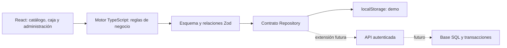

# Arquitectura y adaptación

## Contexto

Proyecto nuevo, negocio ficticio, una sucursal, un operador en navegador y publicación estática solicitada en GitHub Pages. No se ha establecido volumen productivo, equipo de mantenimiento ni presupuesto de servidor. No se dimensiona capacidad a partir de cifras inventadas.

## Decisiones

| Decisión                                      | Motivo                                                                | Alternativa / consecuencia                                                |
| --------------------------------------------- | --------------------------------------------------------------------- | ------------------------------------------------------------------------- |
| React + TypeScript + Vite                     | Pantallas reutilizables, comprobación de tipos y compilación estática | Un framework de servidor aportaría complejidad sin servidor de destino    |
| Motor de negocio independiente de componentes | Probar reglas sin depender de clics ni estilos                        | Evita calcular importes de forma distinta en cada pantalla                |
| Centavos enteros                              | Redondeo explícito de descuento e impuesto incluido                   | No cubre divisas con distinta cantidad de decimales                       |
| Documento local versionado                    | Guardar una operación completa y restaurar demos                      | No sustituye una transacción de base de datos ni acceso seguro            |
| Referencias e instantáneas                    | Retener historia al editar productos/clientes                         | El archivo crecerá; una base real deberá paginar y retener según política |
| Eventos de inventario y efectivo              | Rastrear cada entrada/salida                                          | Se bloquea el borrado de datos que rompería relaciones                    |
| Rutas por hash y base relativa                | Recarga y enlaces compatibles con subdirectorio de Pages              | URLs de demo, sin necesidad de SEO para cada pantalla                     |
| Módulos de pantallas diferidos                | Reducir código cargado antes de necesitarlo                           | Se requiere red en primera carga de un módulo                             |

No se introducen caché de servidor, colas ni microservicios: no existe una necesidad demostrada en esta fase.

## Mapa del proyecto

- `src/config.ts`: perfil inicial, moneda, impuesto y categorías.
- `src/seed.ts`: productos, personas sintéticas e historial de demostración coherente con el inventario.
- `src/model.ts`: modelos, validación, venta, devolución, compra, caja y métricas.
- `src/storage.ts`: contrato de persistencia, implementación local y exportación.
- `src/context.tsx`: acceso compartido a estado y operación transaccional.
- `src/App.tsx`: navegación, recuperación de datos dañados y guardado.
- `src/Pos.tsx`, `Inventory.tsx`, `Contacts.tsx`, `Operations.tsx`, `Reports.tsx`, `Settings.tsx`: flujos.
- `src/ui.tsx`: campos, modales, importes, ilustraciones y componentes de presentación.
- `src/styles.css`: diseño adaptable y estilos de impresión.

## Adaptar a otro negocio

### Desde la aplicación

1. En Configuración, cambiar nombre, descripción, sucursal, color y mensaje del ticket.
2. Crear categorías y productos del nuevo catálogo; editar precios/costos y mínimos.
3. Crear clientes/proveedores de demostración.
4. Descargar un respaldo JSON para transportar esa presentación a otro navegador.

No cargar datos personales reales en la demo pública. Los datos ingresados no se publican en el repositorio, pero permanecen accesibles a quien use el perfil de navegador.

### Crear una edición independiente del código

1. Copiar el repositorio a un nuevo proyecto.
2. Editar `businessProfile` y `defaultCategories` en `src/config.ts`.
3. Sustituir `makeSeed()` por el catálogo y escenario que se quiere demostrar, o por un estado vacío válido (sin sesiones/ventas y con movimientos iniciales que cuadren con el stock).
4. Cambiar `STORAGE_KEY` y `DRAFT_KEY` por claves propias del proyecto. Cambiar marca del favicon, título inicial y enlaces de documentación.
5. Conservar `model.ts` y sus pruebas salvo que cambie la regla comercial.
6. Ejecutar pruebas y compilación; activar Pages con GitHub Actions en el nuevo repositorio.

La configuración inicial se aplica en un navegador sin datos. En navegadores existentes se usa Configuración o se restablece la demo con respaldo previo. Cambiar de moneda exige datos iniciales nuevos: no hay conversión de importes históricos.

## Preparar un negocio real

La reutilización de interfaz y reglas reduce trabajo, pero una aplicación estática local no es un POS productivo multiusuario.

1. **Persistencia:** implementar un servicio autenticado y SQL con tablas business, locations, users, products, customers, suppliers, sales, sale_lines, refunds, stock_movements, purchase_orders, purchase_lines, cash_sessions, cash_entries y audit_events. Toda tabla de negocio debe pertenecer al comercio correspondiente.
2. **Transacciones:** validar precio, rol, stock y caja en el servidor; bloquear las filas de inventario durante la venta; clave de idempotencia única por comercio. Nunca aceptar totales calculados por el cliente como verdad autoritativa.
3. **Acceso:** autenticación real, roles verificables en servidor, aprobaciones para descuentos/devoluciones y segregación por sucursal/comercio. El perfil «Administrador demo» no tiene credenciales ni seguridad real.
4. **Pagos:** integrar proveedor disponible y aprobado para el país; terminal o checkout seguro; webhooks verificados; estados pendiente/pagado/fallido y conciliación. No almacenar datos completos de tarjetas.
5. **Fiscalidad:** definir impuestos por tipo de producto, redondeos y comprobantes según el negocio; integrar facturación autorizada si procede. La tasa uniforme de demo no cubre reglas fiscales reales.
6. **Operación:** respaldos automáticos con restauración probada, observabilidad, manejo de errores, política de retención, conectividad y capacitación. Verificar escáner e impresora reales.
7. **Extensiones por giro:** variantes y unidades fraccionarias, lotes/caducidad, recetas, comandas, crédito, fidelidad, varias líneas por compra, pagos mixtos y devoluciones parciales según necesidad confirmada.

El contrato `Repository` es síncrono en la demo. Una API real necesitará volverlo asíncrono y sustituir escrituras de un documento completo por comandos de dominio transaccionales (`POST /sales`, `POST /refunds`, etc.). Se conserva el modelo conceptual; no basta cambiar la URL de almacenamiento.

## Límites y recuperación

- `localStorage` tiene una cuota limitada por navegador/origen. Un error de escritura se informa sin actualizar el estado visible como si se hubiera guardado.
- El esquema tiene versión 1. Un respaldo incompatible se rechaza. Se validan referencias, dinero y movimientos de stock.
- La revisión evita sobrescribir una versión ya modificada por otra pestaña y se escuchan cambios de almacenamiento. No es exclusión transaccional garantizada entre dispositivos ni entre dos escrituras simultáneas de diferentes procesos. Usar una pestaña operativa.
- Si los datos guardados son inválidos, se ofrece descargar el original antes de reiniciar; no se sustituyen silenciosamente.
- CSV escapa comillas y neutraliza prefijos comunes de fórmulas. El JSON contiene datos completos de la demo.
- No hay service worker; persistencia no equivale a disponibilidad offline. No se afirma conformidad WCAG completa ni funcionamiento con hardware físico sin pruebas específicas.

## Fases posteriores

**Validación con negocio:** adaptar marca/catálogo y observar una jornada de pruebas con información ficticia. **Piloto controlado:** servidor, roles, base de datos, respaldos y métodos de pago autorizados. **Escala:** sucursales, reservas de inventario, reconciliación y sincronización solo cuando la demanda lo justifique.
